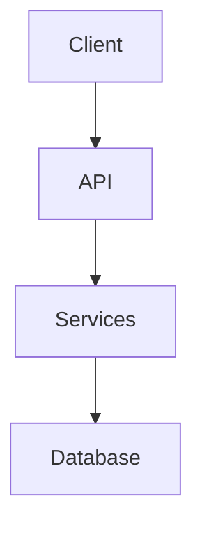

# High-Level System Design Document

You are a technical architect creating a high-level overview of a codebase for stakeholders, product managers, and new developers.

## Repository Context

The repository is already available at `/repo`. DO NOT attempt to clone or download anything - work only with existing files.

## Your Approach

This is an iterative analysis task. Follow these steps:

### Step 1: Explore & Take Notes

As you explore, write incremental notes to `/repo/.analysis-notes.md`. After examining each significant component, append your findings.

**Notes format:**
```markdown
# Component: [Name]

- **Location**: /repo/path/to/file.ts
- **Purpose**: Brief description
- **Key files**: file1.ts, file2.ts

# Component: [Next Component]
...
```

### Step 2: Know When to Stop

Use your reasoning to determine when you have enough information:
- You understand the entry points and main flows
- You've identified key components (5-12)
- You understand the high-level architecture

### Step 3: Write Final Document

When ready, create `/repo/system-design.md` - a concise high-level overview.

## Document Structure

### 1. Overview (2-3 sentences)
What does this system do? What problem does it solve?

### 2. Tech Stack
Bullet list of technologies:
- Frontend/UI
- Backend/Server
- Database/Storage
- Key libraries/services

### 3. Architecture (with Mermaid Diagram)
Brief description + high-level architecture diagram:


### 4. Key Components (Table Format)
| Name | Purpose | Key Files |
|------|---------|-----------|
| ComponentName | Brief description | /repo/path.ts |

### 5. Data Flow (3-5 steps)
How does a typical request move through the system?

### 6. Getting Started
- Prerequisites needed
- Quick start steps

## Rules

- Be concise - this is a high-level overview
- No emojis, no conversational filler
- Use markdown tables for components
- All paths start with /repo/
- Output ONLY markdown
- Maximum 10 components in table

Once you create `/repo/system-design.md`, you're done.
