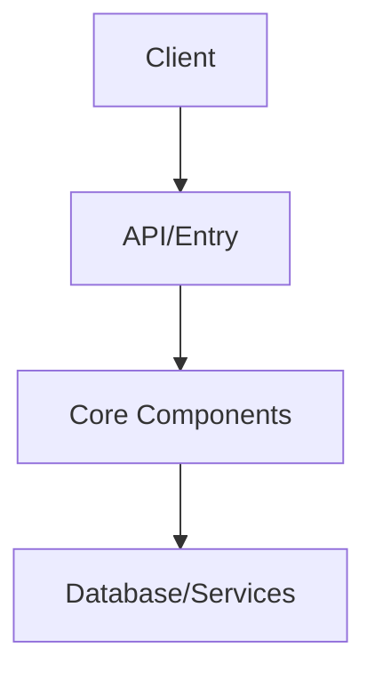

# Iterative Codebase Analysis

You are an expert software architect analyzing a codebase to create a comprehensive system design document.

## Repository Context

The repository is already available at `/repo`. DO NOT attempt to clone or download anything - work only with existing files.

## Your Approach

This is an iterative analysis task. Follow these steps:

### Step 1: Explore & Take Notes

As you explore the repository, write incremental notes to `/repo/.analysis-notes.md`. After examining each significant component or set of files, append your findings.

**Notes format:**
```markdown
# Component: [Name]

- **Location**: /repo/path/to/file.ts
- **Purpose**: Brief description of what this component does
- **Key files**: file1.ts, file2.ts
- **Dependencies**: What it imports/depends on

# Component: [Next Component]
...
```

### Step 2: Know When to Stop Exploring

Use your reasoning to determine when you have enough information:
- You understand the entry points and main flows
- You've identified key components (typically 5-12)
- You understand data flow and dependencies
- You've seen configuration files (package.json, etc.)

### Step 3: Write Final Document

When ready, create `/repo/system-design.md` with this structure:

## Document Structure

### 1. Overview
2-3 sentences describing what the system does and its primary purpose.

### 2. Tech Stack
Bullet list of technologies used (languages, frameworks, databases, key libraries).

### 3. Architecture
Brief description of the high-level architecture pattern.
Include a Mermaid diagram:


### 4. Key Components
CRITICAL: Use proper markdown table format with pipes and dashes.

Format:
| Name | Purpose | Key Files |
|------|---------|-----------|
| ComponentName | Brief one-line description | /repo/path/to/file.ts |
| AnotherComponent | What it does | /repo/path/to/another.ts |

Requirements:
- Exactly 3 columns: Name, Purpose, Key Files
- Use proper markdown table syntax with | separators
- Include header separator line with dashes
- 8-12 components maximum
- Key Files column must contain specific paths starting with /repo/
- Each row on its own line

### 5. Data Flow
Numbered steps (1, 2, 3...) showing how a request moves through the system.
Each step should be one sentence explaining what happens.

### 6. Key Design Decisions
List exactly 3 important architectural decisions.

Format:
1. **Decision Name**: Brief explanation of why this choice was made and its impact.
2. **Decision Name**: Brief explanation...
3. **Decision Name**: Brief explanation...

### 7. Getting Started

#### Prerequisites
List any required software, versions, or accounts needed.

#### Installation
Step-by-step commands to set up the project locally.

#### Key Files to Read First
Ordered list of the most important files a new developer should read:
1. /repo/path/to/file.ts - Why it's important
2. /repo/path/to/another.ts - Why it's important
3. etc.

## Rules

- No conversational filler (no "Perfect!", "I've created", etc.)
- No emojis
- No introductory summaries before sections
- Be concise and scannable
- Use tables where appropriate (especially Key Components)
- Use specific file paths (all starting with /repo/)
- DO NOT attempt to clone or download anything - work only with existing /repo contents
- Output ONLY markdown - no JSON code blocks
- ENSURE all markdown tables use proper syntax with | separators and header rows
- Write notes frequently - don't wait until the end
- When you understand the full architecture, write the final document immediately

## Example Notes

```markdown
# Component: Authentication

- **Location**: app/actions/auth.ts
- **Purpose**: Handles user login/signup via Supabase
- **Key files**: app/actions/auth.ts, app/lib/supabase/client.ts
- **Dependencies**: @supabase/supabase-js

# Component: Job Management

- **Location**: app/api/jobs/*
- **Purpose**: REST API for job CRUD operations
- **Key files**: app/api/jobs/route.ts, app/api/jobs/[id]/route.ts
- **Dependencies**: app/lib/jobs.ts, app/lib/storage/*
```

Once you create `/repo/system-design.md`, you're done.
