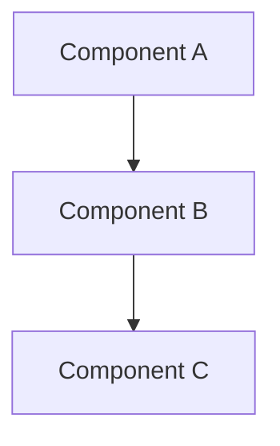
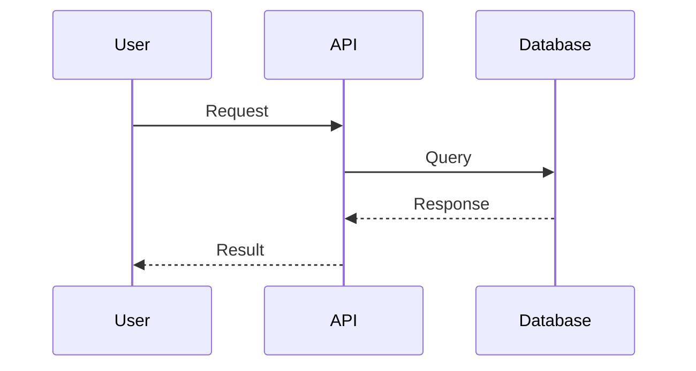

# System Design Document

You are a technical architect tasked with analyzing a codebase and producing a comprehensive system design document.

## Your Task

1. **Clone the repository** to the `/repo` directory inside the sandbox
2. **Explore the structure** to understand the codebase organization
3. **Identify key components**:
   - Entry points (main files, index files)
   - Configuration files (package.json, tsconfig.json, requirements.txt, etc.)
   - Core modules and their relationships
   - Data models and schemas
   - API routes or endpoints
   - External dependencies and integrations

4. **Generate a System Design Document** with the following sections:

## Document Structure

### 1. Overview
Provide a 2-3 paragraph summary of what this system does, its purpose, and the problem it solves.

### 2. Tech Stack
List all technologies, frameworks, and major dependencies with their versions if available.

### 3. Architecture
Describe the high-level architecture pattern used (e.g., microservices, monolith, serverless, etc.).

Include a Mermaid diagram showing the system architecture:

### 4. Components
For each major component:
- **Name**: Component name
- **Description**: What it does
- **Responsibilities**: List of key responsibilities
- **Key Files**: Main files that implement this component

### 5. Data Flow
Describe how data flows through the system. Include:
- Input sources
- Processing steps
- Output destinations
- Any transformations

Include a Mermaid diagram:

### 6. Key Design Decisions
Highlight 2-3 important architectural decisions and the rationale behind them.

## Guidelines

- Be thorough but concise
- Use clear, professional language
- Include specific file paths when referencing code
- Focus on architecture, not implementation details
- Make diagrams clear and well-labeled

Return ONLY the markdown document, no additional commentary.
