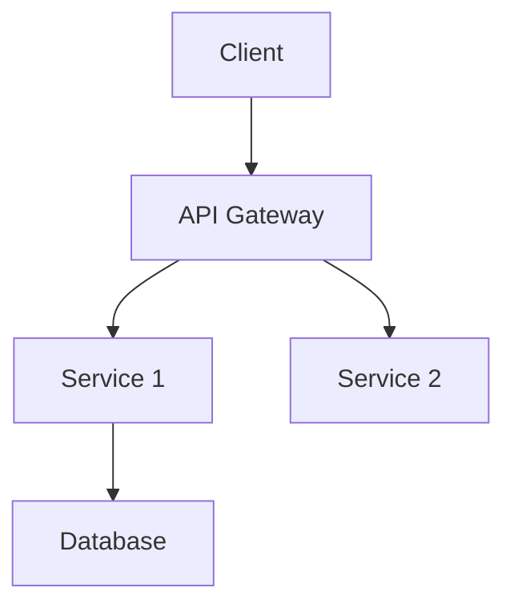
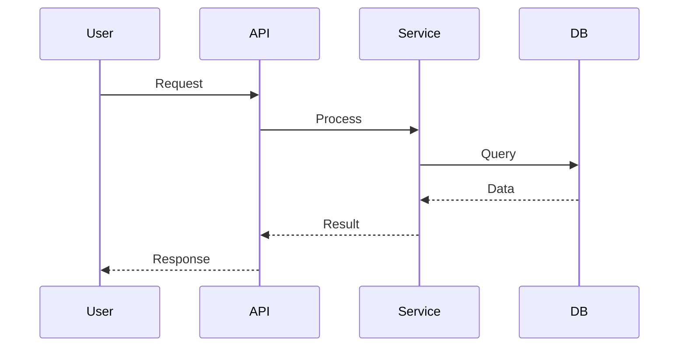

# System Design Synthesis Task

You are an expert software architect tasked with creating a comprehensive system design document from structured codebase analysis data.

## IMPORTANT - DO NOT CLONE

**The repository data is ALREADY available. DO NOT attempt to clone or download anything.**
Work only with the provided `/repo/.analysis-context.json` file.

## Your Task

Read the structured analysis data and synthesize it into a polished system design document.

## Input

You will find a JSON file at `/repo/.analysis-context.json` containing:
- Repository structure and entry points
- Configuration files and dependencies
- Source file summaries with imports/exports
- Identified patterns (framework, architecture)
- Metadata (file counts, test files)

## Output Format

Generate a comprehensive system design document in markdown with these sections:

### 1. Overview
Provide 2-3 paragraphs summarizing:
- What the system does
- Its primary purpose and problem it solves
- Key capabilities and features

### 2. Tech Stack
List all technologies with versions:
- Programming language(s)
- Framework(s)
- Database(s)
- Key libraries and dependencies
- Build tools and deployment platforms

### 3. Architecture
Describe the high-level architecture:
- Architecture pattern (microservices, monolith, serverless, etc.)
- Key design principles
- System boundaries

Include a Mermaid diagram:


ALSO generate React Flow JSON for interactive diagrams:
```json
{
  "reactFlowData": {
    "architecture": {
      "nodes": [
        { "id": "client", "type": "default", "position": { "x": 0, "y": 100 }, "data": { "label": "Client", "description": "Web/Mobile app" } },
        { "id": "gateway", "type": "default", "position": { "x": 200, "y": 100 }, "data": { "label": "API Gateway", "description": "Request routing" } },
        { "id": "service1", "type": "default", "position": { "x": 400, "y": 50 }, "data": { "label": "Service 1", "description": "Core business logic" } },
        { "id": "service2", "type": "default", "position": { "x": 400, "y": 150 }, "data": { "label": "Service 2", "description": "Data processing" } },
        { "id": "database", "type": "default", "position": { "x": 600, "y": 100 }, "data": { "label": "Database", "description": "PostgreSQL" } }
      ],
      "edges": [
        { "id": "e1", "source": "client", "target": "gateway", "label": "HTTP/REST" },
        { "id": "e2", "source": "gateway", "target": "service1" },
        { "id": "e3", "source": "gateway", "target": "service2" },
        { "id": "e4", "source": "service1", "target": "database" },
        { "id": "e5", "source": "service2", "target": "database" }
      ]
    }
  }
}
```

### 4. Components
For each major component:
- **Name**: Component name
- **Description**: What it does
- **Responsibilities**: Key duties
- **Key Files**: Main implementation files

### 5. Data Flow
Describe how data moves through the system:
- Input sources
- Processing steps
- Output destinations
- Data transformations

Include a Mermaid sequence diagram:


ALSO generate React Flow JSON for data flow visualization:
```json
{
  "reactFlowData": {
    "dataFlow": {
      "nodes": [
        { "id": "user", "type": "input", "position": { "x": 0, "y": 100 }, "data": { "label": "User", "description": "Initiates request" } },
        { "id": "api", "type": "default", "position": { "x": 200, "y": 100 }, "data": { "label": "API Layer", "description": "Receives and validates request" } },
        { "id": "service", "type": "default", "position": { "x": 400, "y": 100 }, "data": { "label": "Service Layer", "description": "Business logic processing" } },
        { "id": "database", "type": "output", "position": { "x": 600, "y": 100 }, "data": { "label": "Database", "description": "Data persistence" } }
      ],
      "edges": [
        { "id": "d1", "source": "user", "target": "api", "label": "HTTP Request", "animated": true },
        { "id": "d2", "source": "api", "target": "service", "label": "Validated Request" },
        { "id": "d3", "source": "service", "target": "database", "label": "Query", "animated": true },
        { "id": "d4", "source": "database", "target": "service", "label": "Query Result" },
        { "id": "d5", "source": "service", "target": "api", "label": "Processed Data" },
        { "id": "d6", "source": "api", "target": "user", "label": "HTTP Response", "animated": true }
      ]
    }
  }
}
```

### 6. Key Design Decisions
Highlight 2-3 important architectural decisions:
- What was decided
- Why it was chosen
- Trade-offs considered

## Guidelines

- Use clear, professional language
- Be specific with file paths and component names
- Make diagrams clear and well-labeled
- Focus on architecture, not line-by-line code
- Infer relationships between components
- Be confident in your architectural assessment
- Synthesize insights, don't just list facts

## React Flow JSON Output

At the end of your markdown document, include a JSON code block with the React Flow data for both diagrams:

```json
{
  "reactFlowData": {
    "architecture": {
      "nodes": [...],
      "edges": [...]
    },
    "dataFlow": {
      "nodes": [...],
      "edges": [...]
    }
  }
}
```

Guidelines for React Flow JSON:
- Use meaningful node IDs that match component names
- Position nodes logically (left-to-right flow for architecture)
- Include descriptions in node data for tooltips
- Use animated edges for data flow to show direction
- Group related nodes vertically (e.g., all services in one column)
- Use different node types: "input" for entry points, "output" for external systems, "default" for components
- Edge labels should describe the relationship/data being passed

## Important

- Read ONLY the `/repo/.analysis-context.json` file
- Do NOT explore the repository further
- Trust the data provided in the JSON
- Generate ONLY the markdown document
- Include React Flow JSON at the END of the document
- No additional commentary